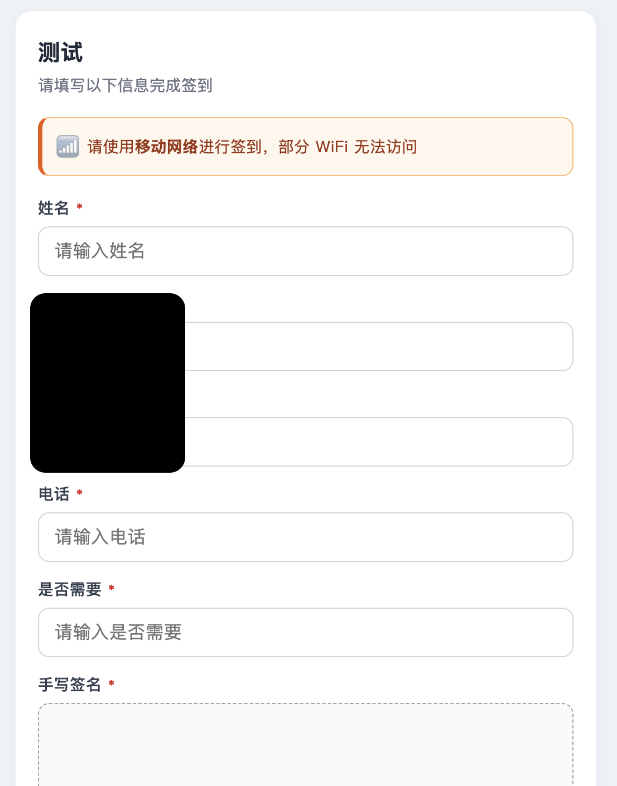
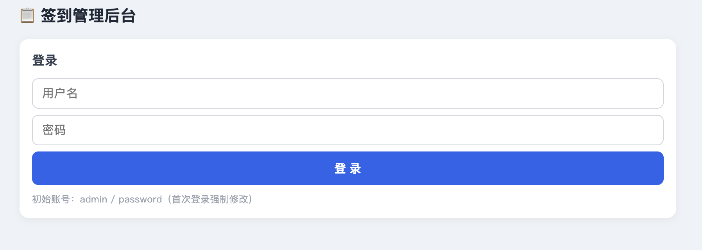

# NAS 扫码签到系统

一个专为 NAS 设计的轻量级扫码签到（表单）系统。参会者扫二维码即可填写信息，管理员可实时查看、导出带格式的 Excel 签到表。

## 功能特性

- **扫码签到**：参会者用手机扫码，填写信息提交即可
- **多会议管理**：每次会议独立二维码、独立数据、独立导出
- **自定义字段**：姓名、性别、电话、身份证号、班级、职务、身份、工号、学号、报名号、邀请码、备注、手写签名，按需勾选
- **自定义列**：除预设字段外，可自由添加任意列（如"是否需要用餐"）
- **列顺序自由调整**：勾选顺序即列顺序，可上下调整
- **必填/选填**：每个字段可单独设置是否必填
- **手写签名**：签到时可手写签名，导出 Excel 时作为图片嵌入单元格
- **算术验证码**：防止机器人批量灌水
- **链接 7 天有效期**：过期自动失效，防止被恶意利用
- **多用户支持**：管理员组（最多 3 个）+ 普通用户组，数据隔离
- **数据加密**：姓名、电话等敏感信息 AES-256-GCM 加密存储



## 技术栈

- 后端：Node.js 18 + Express + better-sqlite3
- 前端：原生 HTML/CSS/JavaScript（无框架依赖）
- Excel 导出：exceljs
- 加密：Node.js 内置 crypto（AES-256-GCM）
- 数据库：SQLite（单文件）
- 部署：Docker

## 环境要求

- 支持 Docker 的 NAS（群晖、飞牛、威联通等）或 Linux 服务器
- Mac 或 Windows 电脑（用于构建镜像）
- 公网 IP+ DDNS（如果要从外网访问）
- 反向代理 + HTTPS（推荐，用于加密传输）

## 部署步骤

### 第一步：在 Mac 上构建镜像

```bash
cd ~/Desktop/checkin-server

# 构建 x86_64 架构镜像
DOCKER_DEFAULT_PLATFORM=linux/amd64 docker build --no-cache -t checkin-server:1.0 .

# 导出为 tar 文件
docker save -o checkin-server.tar checkin-server:1.0

# 确认文件生成
ls -lh checkin-server.tar
```

### 第二步：上传到 NAS

用文件管理器，把 `checkin-server.tar` 上传到 NAS 的：

```
/vol1/1000/docker/checkin-server.tar
```

同时在 NAS 上创建数据目录：

```
/vol1/1000/docker/checkin-data/
```

### 第三步：导入镜像

在 NAS 的 Docker 应用里：

- 群晖：Container Manager → 映像 → 操作 → 导入 → 从文件添加
- 飞牛：Docker → 镜像 → 导入镜像

选择 `checkin-server.tar`，等待导入完成。

### 第四步：创建容器

选中 `checkin-server:1.0` 镜像，点击「创建容器」或「运行」，按以下配置：

| 配置项 | 值 |
| --- | --- |
| 容器名称 | `checkin-server` |
| 开机自启 | ✅ 勾选 |
| 端口映射 | 本地 `自选端口` → 容器 `8080`（TCP） |
| 存储映射 | `/vol1/1000/docker/checkin-data` → 容器 `/data` |
| 网络 | bridge |

**环境变量**（必须设置）：

| 变量名 | 说明 | 示例 |
| --- | --- | --- |
| `DATA_KEY` | 数据加密密钥，至少 32 位随机字符串，一旦设定不可更改 | `Xk9mP2qLw9988tY7uI1oA3sD5fkihb0k` |
| `SESSION_SECRET` | Session 密钥 | `a8f2k9p39i9i9i94b6v` |

**重要提醒**：`DATA_KEY` 请抄写保存到安全的地方（密码管理器或纸质记录）。`DATA_KEY` 一旦丢失，所有已加密的签到数据将无法恢复。

### 第五步：启动容器

启动后查看日志，应显示：

```
签到服务已启动，监听端口 8080
已创建初始管理员：admin / password（首次登录后强制修改）
```

### 第六步：配置反向代理（推荐）

如果你有公网 IP和域名，建议配置 HTTPS 反向代理：


## 首次使用

1. 浏览器打开 `https://你的域名:端口/admin`
2. 输入初始账号 `admin` / 密码 `password`
3. 系统强制跳转到修改账号界面：
   - 输入新用户名（3-20 位字母/数字/下划线）
   - 输入新密码（≥9 位，含大小写字母、数字、符号）
4. 提交成功后，旧的 `admin` 账号被自动删除，用新账号重新登录
5. 开始创建会议、生成二维码、查看数据



## 数据安全

| 项目 | 说明 |
| --- | --- |
| 传输加密 | HTTPS（通过反向代理） |
| 存储加密 | 姓名、电话、备注、签名等字段 AES-256-GCM 加密 |
| 手机号去重 | 使用 HMAC-SHA256 哈希存储，明文不落库 |
| 密码哈希 | scrypt + 随机 salt |
| 接口限流 | 每分钟每 IP 最多 60 次请求 |
| 验证码 | 算术验证码，防止机器人灌水 |
| 链接有效期 | 会议二维码 7 天后自动失效 |
| 数据隔离 | 用户之间数据完全独立，管理员可跨用户查看 |

## 目录结构

```
checkin-server/
├── Dockerfile
├── package.json
├── server.js
├── .dockerignore
├── .gitignore
├── README.md
├── docs/
│   └── images/          # 截图存放目录
└── public/
    ├── index.html       # 签到页
    ├── admin.html       # 管理后台
    └── qrcode.min.js    # 二维码生成库
```

## 常见问题

### 1. 扫码后打不开签到页

- 确认手机使用 4G/5G 流量（部分 WiFi 不支持 IPv6）
- 确认群晖/飞牛的防火墙已放行对应端口
- 用手机浏览器直接输入完整 URL 测试

### 2. 导出的 Excel 字体显示不对

Excel 文件的字体由打开文件的电脑决定。如果打开电脑没装黑体，Excel 会用相近字体替代，但内容不受影响。打印店或办公电脑通常都装了这些字体。

### 3. 忘记密码

只能通过 SSH 登录 NAS，删除 `checkin-data/checkin.db`，重启容器重建数据库。代价是丢失所有签到数据。

### 4. 手写签名图片错位

代码里已经用 `editAs: 'oneCell'` 锚定单元格，调整行高时图片只会在原单元格内缩放，不会跨单元格。

### 5. 自定义列顺序不生效

请升级到最新版本。列顺序采用统一的有序列表，预设字段和自定义列可以任意混排。

## 免责声明


- 允许个人、学习、研究、非营利组织等**非商业用途**免费使用、修改、分发。
- **禁止任何商业用途**，包括但不限于：作为商业产品出售、作为付费服务的一部分、企业内部商业运营等。
- 作者不对使用后果承担任何责任。
- 使用本项目代码时，请保留本版权声明。